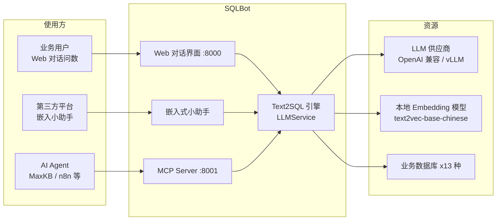

# 第 1 章 项目总览

## 1.1 项目定位

SQLBot 是一款**开源的、基于 RAG（检索增强生成）的 ChatBI / 文本问数系统**。它的核心目标是：

> 让用户用自然语言提问（例如"统计上个月各区域销售额"），系统自动选择数据源、
> 生成 SQL、在业务数据库上执行查询，并将结果以图表形式呈现。

与传统 BI 工具"拖拽配置报表"不同，SQLBot 的交互入口是**对话**，
其背后由 LLM（大语言模型）驱动完整的 提问 → 生成 SQL → 执行 → 可视化 链路。

## 1.2 核心能力

以下能力均可在源码中找到对应实现（括号内为主要代码位置）：

| 能力 | 说明 | 源码位置 |
| --- | --- | --- |
| 开箱即用 | Docker 一键部署，配置 LLM 与数据源即可问答 | `installer/install.sh` |
| 多数据源 | 支持 13 种数据库类型（MySQL、PostgreSQL、Oracle、ClickHouse、SQL Server、Doris、StarRocks、Hive、DM、Kingbase、Redshift、Elasticsearch、Excel/CSV） | `backend/apps/db/constant.py` 的 `DB` 枚举 |
| RAG 增强 | 术语库、SQL 示例库（数据训练）、自定义提示词均通过向量相似度检索后注入 Prompt | `backend/apps/terminology/`、`backend/apps/data_training/`、`backend/apps/datasource/embedding/` |
| 工作空间隔离 | 多租户：用户-工作空间（workspace）-资源 三级隔离 | `sys_workspace`、`sys_user_ws` 表及 `require_permissions` |
| 行列级数据权限 | 普通用户受行过滤条件、列可见性约束，由 LLM 将过滤条件改写进 SQL | `backend/apps/datasource/crud/permission.py`、`row_permission.py` |
| 智能体嵌入 | 小助手（Assistant）可嵌入第三方网页，或对接第三方数据源 API | `backend/apps/system/crud/assistant.py` |
| MCP 协议 | 通过 fastapi-mcp 自动暴露 MCP Server，可被 MaxKB、n8n、DataEase 等调用 | `backend/main.py` 的 `FastApiMCP`、`backend/apps/mcp/mcp.py` |
| 自我进化 | 支持自定义提示词、术语库、SQL 示例持续优化生成效果 | `sqlbot_xpack.custom_prompt`、`apps/terminology`、`apps/data_training` |
| 追问/重生成/分析/预测 | `/regenerate`、`/analysis`、`/predict` 快捷指令 | `backend/apps/chat/models/chat_model.py` 的 `QuickCommand` |
| 多 LLM 供应商 | OpenAI 兼容协议与 vLLM 协议，工厂 + 缓存创建实例 | `backend/apps/ai_model/model_factory.py` |
| 对话审计 | 每一步 LLM 调用的完整消息、耗时、Token 消耗落库 | `chat_log` 表（`ChatLog` 模型） |

## 1.3 技术栈

### 后端（`backend/`）

| 类别 | 技术 |
| --- | --- |
| 语言/运行时 | Python 3.11，包管理使用 **uv** |
| Web 框架 | FastAPI + Uvicorn（ASGI） |
| ORM/模型 | SQLModel（SQLAlchemy 之上的 Pydantic 封装） |
| 数据库迁移 | Alembic（`backend/alembic/versions/` 中 70+ 个版本，应用启动时自动 upgrade head） |
| 元数据库 | PostgreSQL（内置于容器，也支持外部库；`SQLBOT_DB_URL` 可指向其他库） |
| LLM 编排 | LangChain（`langchain_openai`、`langchain_community`、`BaseChatModel`） |
| SQL 解析 | sqlglot（方言感知解析、表名提取、安全检查）、sqlparse（格式化） |
| 向量化 | sentence-transformers 本地模型（默认 `shibing624/text2vec-base-chinese`，镜像内置于 `/opt/sqlbot/models`） |
| 缓存 | FastAPI-Cache（内存或 Redis，`CACHE_TYPE` 切换） |
| 数据处理 | pandas、orjson、xlsxwriter（Excel 导出） |
| 商业扩展包 | `sqlbot_xpack`（许可、行列权限模型、自定义提示词、认证源） |

### 前端（`frontend/`）

| 类别 | 技术 |
| --- | --- |
| 框架 | Vue 3.5 + TypeScript + Vite 6 |
| UI | Element Plus、element-plus-secondary |
| 图表 | AntV G2 5.x（对话图表）、AntV S2（表格）、AntV X6（表关系编辑） |
| 状态管理 | Pinia |
| 国际化 | vue-i18n（zh-CN / zh-TW / en / ko-KR 四种语言） |
| 富文本 | TinyMCE（数据训练/提示词编辑） |

### 图表服务端渲染（`g2-ssr/`）

Node.js 服务：基于 AntV G2 + node-canvas（cairo/pango 原生依赖），
将图表配置渲染为 PNG 图片，供 MCP 场景返回图片 URL。由 pm2 守护。

### 部署

Docker 多阶段构建（`Dockerfile`），installer 脚本 + docker-compose。

## 1.4 仓库目录结构

```text
SQLBot/
├── backend/                      # Python 后端（FastAPI）
│   ├── main.py                   # 应用入口：lifespan、中间件、MCP 挂载
│   ├── alembic/                  # 数据库迁移（versions/ 下 70+ 版本脚本）
│   ├── apps/                     # 业务模块（按领域划分）
│   │   ├── api.py                # 路由聚合（api_router）
│   │   ├── chat/                 # 对话与 Text2SQL 核心
│   │   │   ├── api/chat.py       #   问答 REST 接口
│   │   │   ├── curd/chat.py      #   会话/记录 CRUD 与日志
│   │   │   ├── models/chat_model.py # Chat/ChatRecord/ChatLog 等模型
│   │   │   └── task/llm.py       #   ★ LLMService 任务引擎（核心中的核心）
│   │   ├── ai_model/             # LLM 工厂与 Embedding 模型缓存
│   │   ├── dashboard/            # 仪表板
│   │   ├── data_training/        # SQL 示例（数据训练）
│   │   ├── datasource/           # 数据源/表/字段/行列权限/向量检索
│   │   ├── db/                   # 多数据库连接、执行、安全检查
│   │   ├── mcp/                  # MCP 业务接口（token、提问、数据源列表）
│   │   ├── settings/             # 基础设置
│   │   ├── swagger/              # OpenAPI i18n 与文档
│   │   ├── system/               # 用户/工作空间/小助手/AI模型/APIKey/认证
│   │   ├── template/             # Prompt 模板生成器（读 templates/*.yaml）
│   │   └── terminology/          # 术语库
│   ├── common/
│   │   ├── audit/                # 操作审计日志（system_log 装饰器）
│   │   ├── core/                 # config/db/deps/security/cache/中间件
│   │   ├── utils/                # 分布式锁、embedding 线程、i18n 等工具
│   │   └── error.py              # 自定义异常
│   ├── locales/                  # 后端 i18n（en/zh-CN/zh-TW/ko-KR）
│   ├── templates/
│   │   ├── template.yaml         # ★ 基础 Prompt 模板（sql/chart/analysis...）
│   │   └── sql_examples/         # 各数据库方言的 SQL 示例模板（12 个 yaml）
│   └── pyproject.toml            # uv 依赖定义
├── frontend/                     # Vue3 前端
│   ├── src/views/                # 页面：chat / dashboard / datasource / setting...
│   ├── src/api/                  # Axios API 封装（19 个模块）
│   ├── src/router/               # 路由与动态路由
│   ├── src/stores/               # Pinia 状态
│   └── src/i18n/                 # 四语言文案
├── g2-ssr/                       # 图表服务端渲染（Node.js + pm2）
├── installer/                    # 一键安装脚本（install.sh + install.conf + sctl）
├── tests/                        # 部分测试（分布式锁、转义修复等）
├── Dockerfile / Dockerfile-base  # 多阶段镜像构建
├── docker-compose.yaml           # 官方 compose 编排
└── start.sh                      # 容器启动脚本（PG + g2-ssr + MCP + 主应用）
```

## 1.5 一图看懂系统定位



## 1.6 关键设计取舍（先睹为快）

1. **同步 CRUD + 线程池执行**：问答主流程通过 `asyncio.to_thread` /
   `ThreadPoolExecutor(max_workers=200)` 把阻塞式 LLM 流与数据库 IO
   从事件循环中剥离（`backend/apps/chat/task/llm.py` 第 61 行 `executor`）。
2. **SSE 单向流式**：前端以 Server-Sent Events 逐段接收
   `sql-result / sql / sql-data / chart / finish` 事件，天然适配 LLM 流式输出。
3. **LLM 输出 JSON 协议**：SQL、图表配置、数据源选择均要求 LLM 输出约定 JSON，
   后端 `extract_nested_json` 抽取 + orjson 解析 + 字段校验（`check_sql`、`check_save_chart`）。
4. **sqlglot 双重安全网**：执行前既做只读白名单检查（`check_sql_read`），
   又做表名越权检查（`extract_tables_from_sql` 对照 schema 白名单）。
5. **xpack 可插拔**：许可、行列权限配置、自定义提示词、第三方认证
   全部收敛在 `sqlbot_xpack` 包中，开源版通过其稳定 API 调用。

下一章：[第 2 章 快速部署与启动流程](./02-deployment-guide.md)
