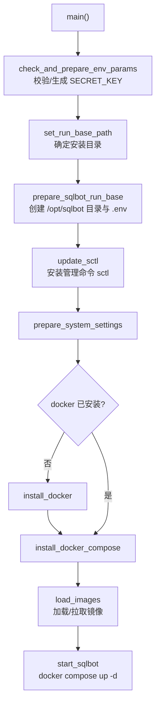
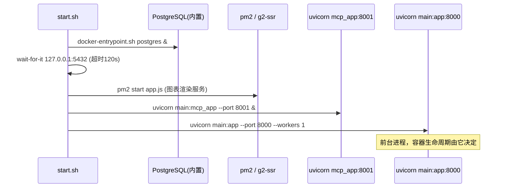
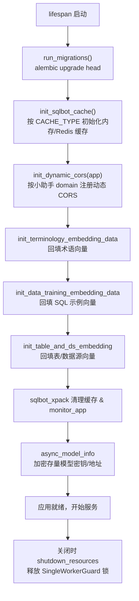

# 第 2 章 快速部署与启动流程

本章覆盖三种部署方式，并逐层拆解容器内部的启动顺序（源码依据：
`installer/install.sh`、`installer/install.conf`、`docker-compose.yaml`、
`Dockerfile`、`start.sh`）。

## 2.1 方式一：installer 一键安装（官方推荐）

### 前置条件

- Linux 服务器，可访问 Docker Hub（或提前 `docker load` 离线镜像）
- Docker 与 docker-compose（脚本 `install_docker` / `install_docker_compose` 会自动安装）

### 安装步骤

```bash
# 1. 下载安装包并解压
tar -zxvf sqlbot-installer-vX.Y.Z.tar.gz
cd sqlbot-installer

# 2. 修改配置（可选，均有默认值）
vi install.conf

# 3. 执行安装
sudo ./install.sh
```

### install.conf 关键配置

| 配置项 | 默认值 | 说明 |
| --- | --- | --- |
| `SQLBOT_BASE` | `/opt` | 安装根目录，数据落在 `/opt/sqlbot` |
| `SQLBOT_WEB_PORT` | `8000` | Web 与 API 端口 |
| `SQLBOT_MCP_PORT` | `8001` | MCP Server 端口 |
| `SQLBOT_EXTERNAL_DB` | `false` | 是否使用外部 PostgreSQL |
| `SQLBOT_DB_*` | localhost/5432/sqlbot/root | 外部库连接参数 |
| `SQLBOT_SECRET_KEY` | 空 | 留空时 `prepare_secret_key` 自动生成随机密钥并持久化 |
| `SQLBOT_CACHE_TYPE` | `memory` | 可切 `redis`（需配 `CACHE_REDIS_URL`） |
| `SQLBOT_DEFAULT_PWD` | `SQLBot@123456` | 普通用户默认密码 |

安装脚本核心流程（`install.sh` 中的 `main`）：



安装完成后使用 `sctl` 管理服务（启动/停止/状态/日志）。

## 2.2 方式二：docker-compose

`docker-compose.yaml` 定义了单容器编排（镜像内置 PostgreSQL）：

```yaml
services:
  sqlbot:
    image: dataease/sqlbot
    ports:
      - 8000:8000    # Web UI + REST API
      - 8001:8001    # MCP Server
    environment:
      POSTGRES_SERVER: localhost        # 容器内置 PG
      SECRET_KEY: ${SECRET_KEY:?...}    # 必须在 .env 中设置
      BACKEND_CORS_ORIGINS: "http://localhost,..."
    volumes:
      - ./data/sqlbot/excel:/opt/sqlbot/data/excel
      - ./data/sqlbot/file:/opt/sqlbot/data/file
      - ./data/sqlbot/images:/opt/sqlbot/images
      - ./data/sqlbot/logs:/opt/sqlbot/app/logs
      - ./data/postgresql:/var/lib/postgresql/data
```

启动：先在 `.env` 写入 `SECRET_KEY=xxx`，然后 `docker compose up -d`。

## 2.3 方式三：源码启动（开发调试）

```bash
# 后端
cd backend
uv sync --extra cpu              # 安装依赖（需 Python 3.11）
# 配置 ../.env：POSTGRES_*、SECRET_KEY 等（config.py 读取 ../.env）
uvicorn main:app --host 0.0.0.0 --port 8000 --reload

# 前端
cd frontend
npm install
npm run dev                       # vite dev server（默认 5173）
```

说明：

- `backend/common/core/config.py` 中 `Settings` 通过 `env_file="../.env"`
  加载仓库根目录 `.env`，所有配置项均可被环境变量覆盖；
- 源码模式下需自备 PostgreSQL；启动时 `lifespan` 自动执行 Alembic 迁移；
- g2-ssr 仅 MCP 图片场景需要，开发 Web 功能时可不启动。

## 2.4 容器内启动顺序（start.sh 拆解）

镜像内 `ENTRYPOINT ["sh", "start.sh"]`，完整启动序列：



注意 `--workers 1`：因为应用内含进程内状态（连接池、embedding 回填线程、
分布式锁标记），官方镜像固定单 worker 运行；多副本水平扩展需依赖 Redis 缓存
与外部数据库，详见第 8 章坑点分析。

## 2.5 FastAPI 应用生命周期（main.py lifespan）

`main:app` 进程启动后，FastAPI `lifespan` 依次执行：



其中 E/F/G 三步使用 `@SingleWorkerGuard.once` 装饰器，
确保多实例部署时只有一个实例执行回填（基于分布式锁，见
`backend/common/utils/distributed_lock.py`）。

## 2.6 首次访问与初始化

1. 浏览器访问 `http://<IP>:8000`，使用 `admin / SQLBot@123456`（默认密码
   `DEFAULT_PWD`，可在安装配置中修改）登录；
2. **配置 AI 模型**：系统设置 → 模型管理，填入供应商 endpoint 与 API Key，
   设为默认模型（`ai_model` 表，`default_model=true`；问答时
   `get_default_config` 读取）；
3. **创建数据源**：数据源页面选择数据库类型、填写连接信息，
   勾选可问数的表并维护表/字段注释（写入 `core_table` / `core_field`，
   并异步触发表向量计算）；
4. **开始问数**：新建对话 → 选择数据源（或不选，由系统自动选择）→ 提问。

## 2.7 健康检查与运维

- Dockerfile 内置健康检查：`GET http://localhost:8000/${CONTEXT_PATH}`，
  间隔 30s、超时 10s、重试 3 次；
- 日志落 `/opt/sqlbot/app/logs`（`LOG_LEVEL` 可调），
  LLM 全链路明细另存 `chat_log` 表（前端"执行详情"可查看）；
- `SERVER_IMAGE_HOST` 需替换为实际可访问的 MCP 图片地址
  （`http://<IP>:8001/images/`），否则 MCP 返回的图片 URL 不可达。

下一章：[第 3 章 整体架构](./03-architecture.md)
