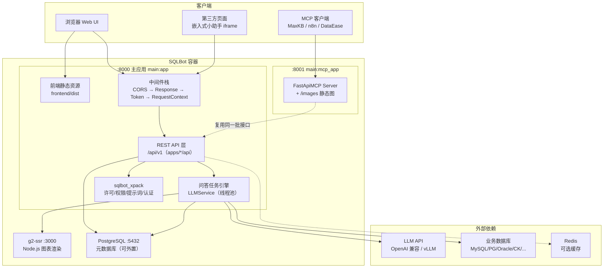
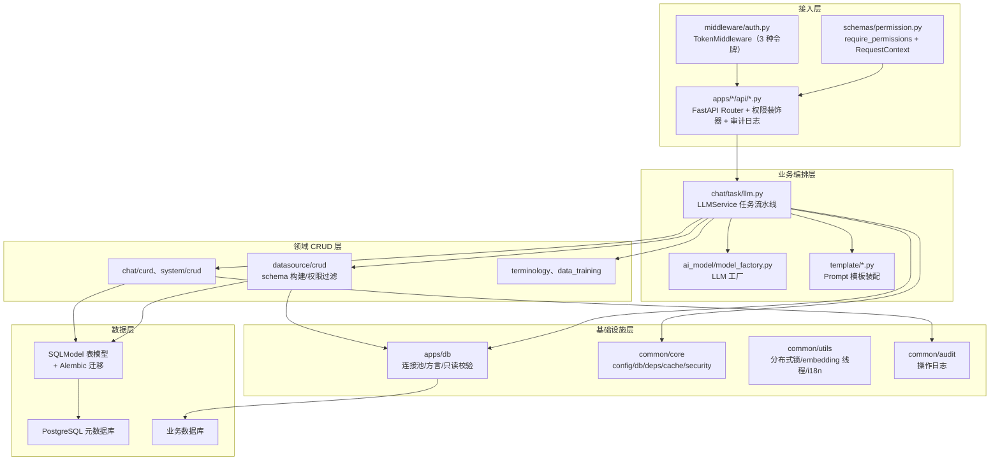
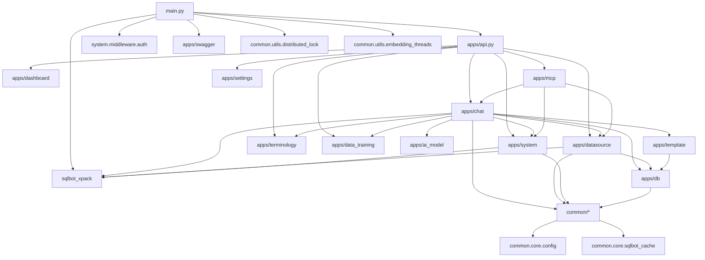
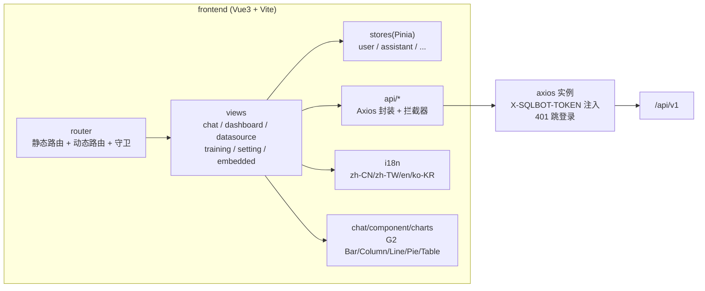
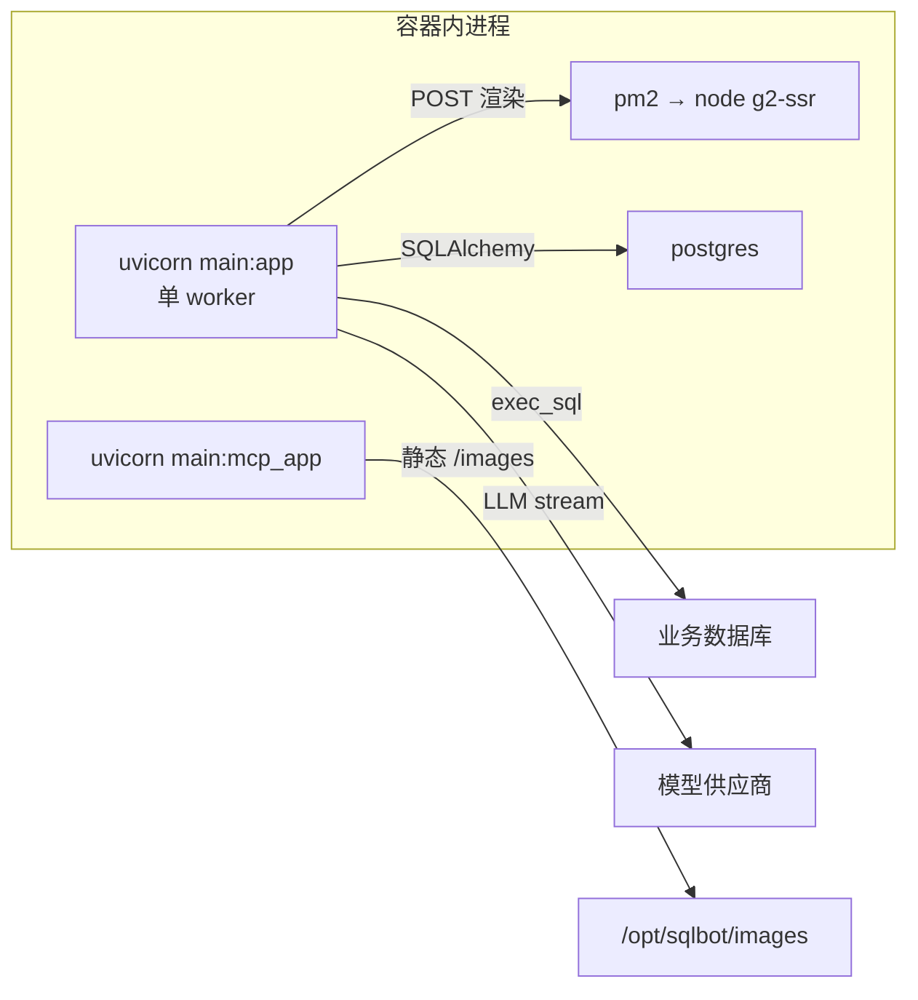

# 第 3 章 整体架构

## 3.1 总体架构图

**要点解读**：

- **双端口单镜像**：`main:app`（8000，含前端静态资源托管）与 `main:mcp_app`
  （8001，MCP + 图片静态服务）由同一份代码、两个 uvicorn 进程承载，
  见 `start.sh` 与 `backend/main.py` 末尾的 `mcp_app` 定义。
- **MCP 零手写**：`FastApiMCP(app, include_operations=[...])` 自动把
  `mcp_question`、`mcp_start`、`mcp_datasource_list` 等 7 个 operation
  转成 MCP Tool，无需重复定义协议层。
- **g2-ssr 独立进程**：图表 PNG 渲染走 Node.js（canvas 原生依赖），
  主应用以 HTTP POST 方式提交渲染任务（`request_picture`），
  产物落 `/opt/sqlbot/images`，由 8001 端口 `/images` 路由对外提供。

## 3.2 后端分层

后端是典型的"**API 层 → CRUD 层 → 模型层**"结构，外加两个横向层：

各层职责（以问答链路为例）：

| 层 | 代表代码 | 职责 |
| --- | --- | --- |
| 接入层 | `chat/api/chat.py` | 参数校验（Pydantic）、鉴权、SSE 封装、异常兜底 |
| 编排层 | `chat/task/llm.py` | 多步 LLM 流水线、消息构建、结果解析、持久化埋点 |
| CRUD 层 | `chat/curd/chat.py`（注意目录名是 `curd`） | 会话/记录/日志增删改查 |
| 基础设施 | `apps/db/db.py` | 多方言连接、LRU 连接池、只读 SQL 校验 |
| 数据层 | SQLModel + Alembic | 表结构与迁移（启动自动 upgrade） |

## 3.3 后端模块依赖图

按 `import` 关系整理出的模块依赖（箭头表示"依赖"）：

依赖方向的关键约定：

1. `apps/mcp` 复用 `apps/chat` 的 `question_answer_inner`，即 **MCP 与 Web
   共用同一条问答流水线**，只是 `in_chat=False`（输出 Markdown 而非 SSE JSON）；
2. `apps/template` 只依赖 `apps/db/constant.py` 的 `DB` 枚举
   （用 `template_name` 选方言 yaml），不反向依赖业务层；
3. `sqlbot_xpack` 被 chat/system/datasource 依赖，但通过函数级 import 与
   许可开关（`SQLBotLicenseUtil.valid()`）做到"无许可时功能降级"。

## 3.4 前端架构

- 对话页 `views/chat/index.vue`（约 1500 行）承担 SSE 事件分发：
  按 `type`（`id/question/datasource/sql-result/sql/sql-data/chart-result/chart/finish/error`）
  驱动 UI 状态机；
- 图表渲染统一抽象为 `charts/*.ts`（Bar、Column、Line、Pie、Table），
  与后端图表配置的 `type` 字段一一对应；
- 嵌入式场景（`views/embedded/page.vue`）通过
  `X-SQLBOT-ASSISTANT-TOKEN: Embedded <jwt>` 走小助手鉴权。

## 3.5 运行时进程视图

下一章：[第 4 章 核心业务全流程](./04-core-business-flow.md)
