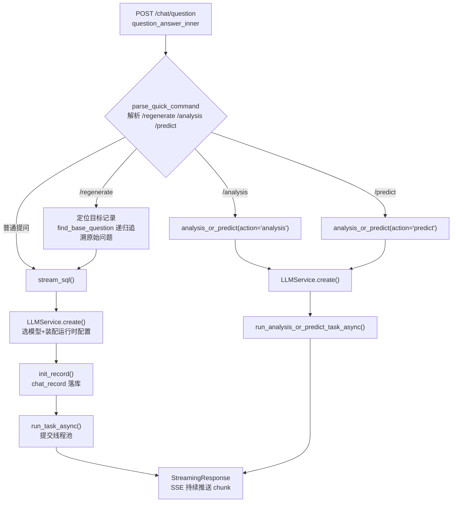
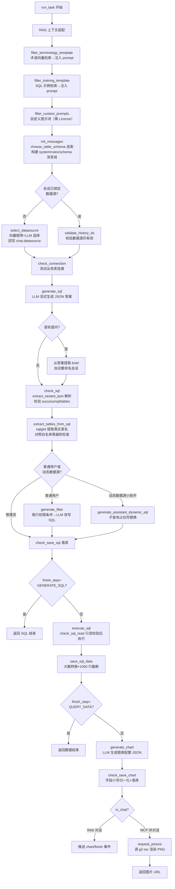
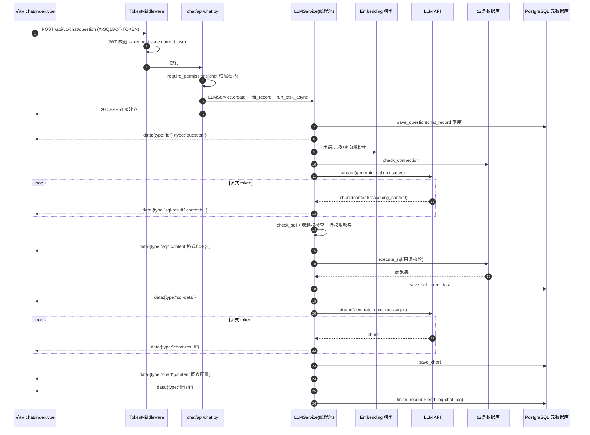
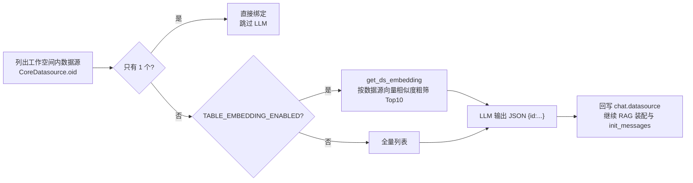

# 第 4 章 核心业务全流程

本章以"**用户提问 → 图表呈现**"为主线，完整拆解 SQLBot 的核心业务流程。
所有函数名均对应真实源码，主战场是两个文件：

- `backend/apps/chat/api/chat.py`（接入与路由）
- `backend/apps/chat/task/llm.py`（`LLMService` 任务引擎）

## 4.1 提问入口与指令分流

`POST /api/v1/chat/question`（`question_answer`）是唯一问答主入口。
进入 `question_answer_inner` 后，首先由 `parse_quick_command` 解析快捷指令：



要点：

- `/regenerate` 支持对**历史任意记录**重新生成，通过 `regenerate_record_id`
  链式回溯（`find_base_question` 递归）找到最初的问题文本；
- `/analysis`、`/predict` 要求目标记录已生成图表（`record.chart` 非空），
  且记录必须属于当前用户与会话（双重归属校验）。

## 4.2 文本转 SQL 全流程（核心流程图）

`LLMService.run_task` 是整条流水线的主体（`llm.py` 中约 300 行的生成器），
完整流程如下：



### 阶段说明

| 阶段 | 源码函数 | 说明 |
| --- | --- | --- |
| RAG 装配 | `filter_terminology_template` 等 | 三类知识库都先做 embedding 相似度筛选（默认阈值 0.4、Top5），命中的内容拼进 Prompt |
| 选表 | `choose_table_schema` → `get_table_schema` | 按表向量与问题余弦相似度取 Top10 张表，拼成 `【DB_ID】【Schema】【Foreign keys】` 文本 |
| 选数据源 | `select_datasource` | 仅当会话未绑定数据源；单数据源直接跳过；多数据源走向量粗筛 + LLM 输出 `{"id": ...}` |
| 生成 SQL | `generate_sql` | LLM 必须输出 JSON：`{success, sql, tables, chart-type, brief}` |
| 权限改写 | `generate_filter` / `build_table_filter` | 行权限规则由 LLM 合并进 WHERE；管理员（id=1）跳过 |
| 执行 | `execute_sql` → `exec_sql` | 执行前 `check_sql_read` 拦截写操作与危险函数 |
| 生成图表 | `generate_chart` | LLM 输出图表配置：`{type, title, columns / axis{x,y,series}}` |

## 4.3 消息构建细节（init_messages）

SQL 生成的 Prompt 并非一条 SystemMessage，而是**多轮伪对话**：

```text
System : 你是智能问数小助手 {sqlbot_name}...（角色+输出格式约束）
Human  : 规则集（sql 规则 + 方言示例，来自 sql_examples/*.yaml）
AI     : "我已掌握所有规则，包括表结构、SQL规范、安全限制和输出格式..."
Human  : 数据库信息 + 表结构 schema + 样例数据
AI     : "我已确认您提供的数据库信息与表结构schema..."
Human  : 自定义提示词（如有）   → AI 确认
Human  : 术语信息（如有）       → AI 确认
Human  : SQL 示例（如有）       → AI 确认
[历史 N 轮真实对话（默认 3 轮，取自 chat_log）]
Human  : 本次问题（含当前时间、上次执行错误信息、语言要求）
```

设计意图：通过"规则确认"轮次强化模型对输出格式与安全约束的遵循度；
历史轮次通过 `get_last_conversation_rounds` 截取，并剔除所有
`sqlbot_system=True` 的系统消息，防止系统提示词在历史记录中累积膨胀。

## 4.4 Web 提问请求时序图



### SSE 事件协议（`type` 字段）

| type | 载荷 | 前端动作 |
| --- | --- | --- |
| `id` / `question` | 记录 ID / 问题文本 | 创建消息气泡 |
| `datasource` / `datasource-result` | 选中的数据源 / 选择过程流 | 展示数据源卡片 |
| `sql-result` | LLM 原始流（含 reasoning_content） | 思考过程打字机 |
| `sql` | 最终格式化 SQL | SQL 代码块展示 |
| `sql-data` | 执行成功标记 | 触发图表数据拉取 |
| `chart-result` / `chart` | 图表生成流 / 最终配置 | G2 渲染图表 |
| `brief` | 新会话标题 | 更新侧边栏 |
| `finish` | - | 结束加载态 |
| `error` | 错误 JSON（message/traceback/type） | 错误提示 |

## 4.5 数据源自动选择子流程

会话未绑定数据源时（例如"自由问数"入口），`select_datasource` 执行：



## 4.6 分析与预测子流程

`POST /chat/record/{id}/{analysis|predict}`：

1. `save_analysis_predict_record` 基于源记录创建衍生记录
   （`analysis_record_id` / `predict_record_id` 回指）；
2. 取源记录图表的字段与数据（`get_fields_from_chart` + `get_chat_chart_data`）；
3. `analysis`：LLM 直接产出文字分析；`predict`：LLM 产出预测数据行
   （`check_save_predict_data` 解析 JSON 数组），前端叠加原数据绘制预测曲线；
4. MCP 场景额外调用 `request_picture` 生成带预测数据的 PNG。

## 4.7 持久化全景

一次提问会写入/更新以下数据：

| 表 | 写入时机 | 内容 |
| --- | --- | --- |
| `chat` | 创建会话 / 绑定数据源 / 重命名 | 会话元信息 |
| `chat_record` | 每步增量保存 | question → sql_answer → sql → sql_exec_result(data) → chart_answer → chart |
| `chat_log` | 每个 OperationEnum 步骤 start/end | 完整 messages、reasoning_content、token_usage、耗时、error |
| `chat_record.regenerate_record_id` | 重新生成 | 版本链 |

`ChatRecord` 的"增量保存"模式（`save_question` → `save_sql_answer` → ...）
保证了**即使中途失败，前端刷新也能看到已完成的中间结果**，
这是第 8 章要展开的一个重要设计。

下一章：[第 5 章 核心模块源码逐块解析](./05-module-analysis.md)
