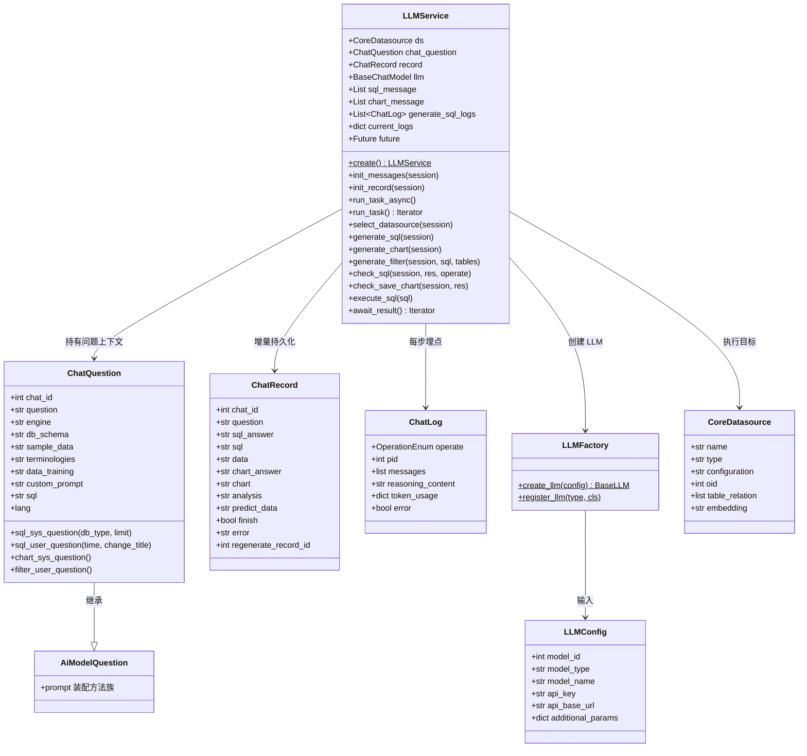
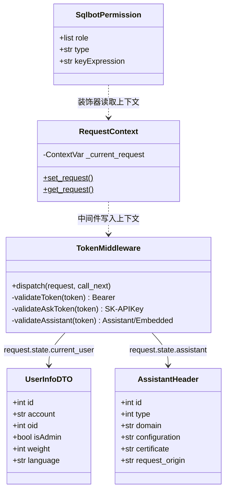
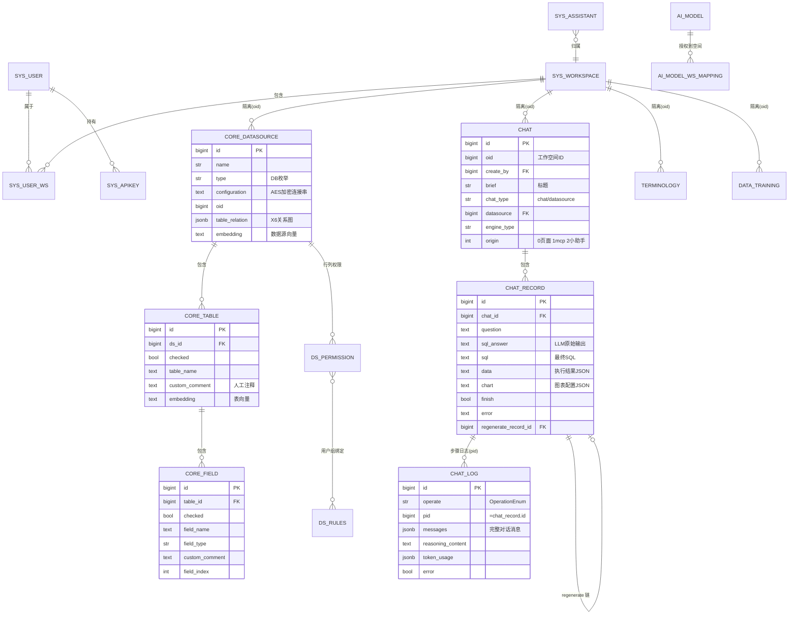
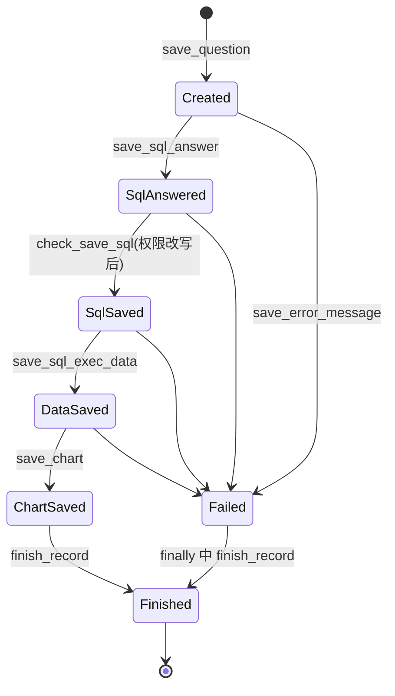

# 第 6 章 核心类与数据结构

## 6.1 问答引擎类图

`LLMService` 是运行时中枢，围绕它的类关系如下：



说明：`ChatQuestion` 继承自 `AiModelQuestion`，后者承担全部 Prompt
模板装配（`sql_sys_question`、`chart_user_question`、`filter_user_question`
等十余个方法），是"**数据对象兼提示词构建器**"的复合角色。

## 6.2 认证与权限类图



## 6.3 数据模型 ER 图



（表名以 SQLModel 模型为准：`chat`、`chat_record`、`chat_log`、
`core_datasource`、`core_table`、`core_field`、`sys_user`、`sys_workspace`、
`sys_user_ws`、`sys_assistant`、`sys_apikey`、`ai_model`、
`ai_model_workspace_mapping`；`ds_permission`/`ds_rules` 位于 xpack。）

## 6.4 关键运行时数据结构

### LLM 输出协议（SQL 生成）

```json
{
  "success": true,
  "sql": "SELECT region, SUM(amount) FROM sales GROUP BY region",
  "tables": ["sales"],
  "chart-type": "column",
  "brief": "各区域销售额统计"
}
```

失败时 `success=false` + `message`，由 `check_sql` 抛出
`SingleMessageError` 并推送 `error` 事件。

### 图表配置协议（LLM 输出 → 前端 G2）

```json
{
  "type": "line",            // bar|column|line|pie|table
  "title": "月度销售趋势",
  "axis": {
    "x": {"name": "月份", "value": "month"},
    "y": [{"name": "销售额", "value": "sales"}],
    "series": {"name": "区域", "value": "region"}
  }
}
```

`check_save_chart` 会将所有 `value` 统一转小写（SQL 结果列名归一化），
并兼容 `y` 为对象（旧格式）或数组（多指标）两种形态；
`columns` 结构用于 `type=table`。

### SSE 消息帧

```text
data:{"type":"sql-result","content":"...","reasoning_content":"..."}\n\n
```

所有帧均为 `data:` 前缀 + orjson 序列化 + 双换行，`type` 见 4.4 节协议表。

### chat_log 消息结构

```json
{"type": "human", "content": "...", "sqlbot_system": true}
```

`sqlbot_system=true` 标记系统提示词消息，重建历史上下文时被过滤，
避免提示词随轮次累积（见 `init_messages`）。

## 6.5 状态机视角：一次问答记录的生命周期



无论成功或异常，`run_task` 的 `finally` 块都会执行
`finish_record` + `session_maker.remove()`，保证记录状态收敛、
线程级 Session 归还。

下一章：[第 7 章 安全、权限、缓存、扩展机制](./07-security-permission-cache-extension.md)
