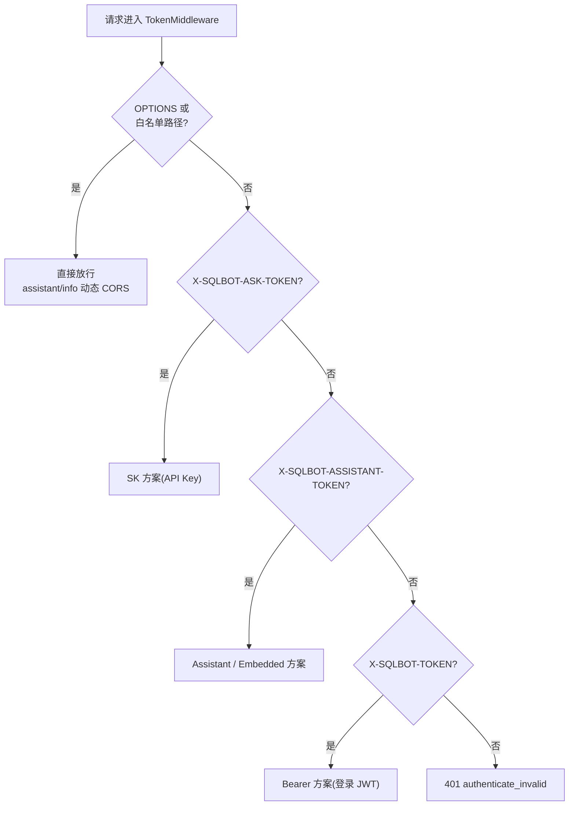
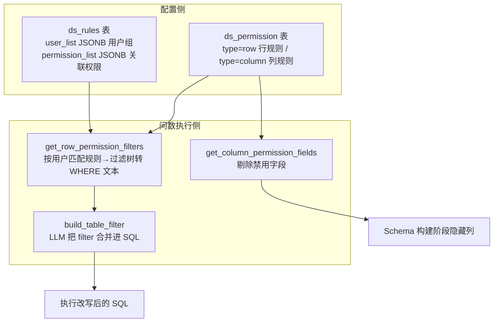

# 第 7 章 安全、权限、缓存、扩展机制

## 7.1 认证体系（TokenMiddleware）

`backend/apps/system/middleware/auth.py` 支持四种凭证，按请求头优先级判定：



| 方案 | 头部 | 校验流程 |
| --- | --- | --- |
| Bearer | `X-SQLBOT-TOKEN: Bearer <jwt>` | `SECRET_KEY` 验签 → 查用户 → 校验状态与空间 |
| SK | `X-SQLBOT-ASK-TOKEN: SK <jwt>` | 先**不验签解码**取 `access_key` → 查 `sys_apikey` → 用该记录的 `secret_key` 二次验签 → 定位绑定用户 |
| Assistant | `X-SQLBOT-ASSISTANT-TOKEN: Assistant <jwt>` | `SECRET_KEY` 验签且 payload 含 `assistant_id` → 构造小助手虚拟用户 |
| Embedded | `X-SQLBOT-ASSISTANT-TOKEN: Embedded <jwt>` | 先无验签解码取 `appId/embeddedId` → 用小助手 `app_secret` 二次验签 → 按 `account` 映射真实用户 |

> 安全细节：Embedded 方案源码中保留了显式 WARNING 注释——
> 首次解码关闭验签（`verify_signature: False`）只为取得 `appId`，
> 随后立即用该小助手的 `app_secret` 做真正验签；`xor_decrypt`
> 是 `embeddedId` 缺省时的兜底解码（固定 key，仅做混淆）。

登录令牌签发：`security.create_access_token`（HS256，`SECRET_KEY`），
有效期 `ACCESS_TOKEN_EXPIRE_MINUTES`（默认 8 天）。

## 7.2 授权体系

### 7.2.1 角色

- **系统管理员**：`id==1 且 account=='admin'`（`UserInfoDTO.isAdmin`）；
- **空间管理员**：`sys_user_ws.weight == 1`；
- **普通用户**：`weight == 0`，`is_normal_user(current_user)` 即 `id != 1`。

### 7.2.2 require_permissions 装饰器

`apps/system/schemas/permission.py` 提供声明式资源级鉴权：

```python
@require_permissions(permission=SqlbotPermission(
    type='chat', keyExpression="request_question.chat_id"))
```

执行逻辑：

1. 从 `RequestContext`（ContextVar，由中间件注入）取当前用户；
2. `role` 校验（`admin` / `ws_admin`）；
3. `keyExpression` 从函数入参解析资源 ID（支持 `args[0]` 与
   `对象.属性` 路径两种语法）；
4. `check_ws_permission`：资源 ID 必须属于当前用户工作空间
   （`get_ws_resource` 查 ds/chat 列表，ds 列表走缓存）。

### 7.2.3 数据行/列权限（问数核心安全能力）



三重防线：

1. **Schema 阶段**：普通用户的 schema 文本不含被禁用列
   （列权限在 `get_table_obj_by_ds` 生效）；
2. **SQL 改写阶段**：行权限规则由 LLM 注入 WHERE（`generate_filter`），
   改写结果同样过 `check_sql` 校验；
3. **表越权检查**：`run_task` 中用 sqlglot 从最终 SQL 提取真实表名，
   与 `choose_table_schema` 返回的白名单比对，出现未授权表直接报错：

```python
actual_tables = extract_tables_from_sql(sql, ds_type=self.ds.type)
unauthorized_tables = actual_tables - set(self.table_name_list)
if unauthorized_tables:
    raise SingleMessageError(f"SQL contains unauthorized tables: ...")
```

### 7.2.4 SQL 只读校验（check_sql_read）

`apps/db/db.py` 在 `exec_sql` 入口强制执行：

| 检查 | 手段 |
| --- | --- |
| 首关键字白名单 | 仅 `SELECT`/`WITH`；`SHOW/DESCRIBE/DESC/EXPLAIN` 需显式开启 `SQLBOT_ALLOW_METADATA_QUERIES`（默认关） |
| 写操作黑名单 | `INSERT/UPDATE/DELETE/CREATE/DROP/ALTER/TRUNCATE/MERGE/COPY/REPLACE/GRANT/REVOKE/USE/SET/CALL` |
| 危险模式 | `DANGEROUS_PATTERNS` 正则（如多语句、注释绕过） |
| AST 级检查 | sqlglot 按方言解析，检测写操作节点（`exp.Insert` 等）与危险函数（`get_dangerous_functions` 按数据库定制） |

## 7.3 敏感数据保护

| 数据 | 保护方式 |
| --- | --- |
| 数据源连接串 | AES 加密存 `core_datasource.configuration`（`aes_decrypt` 解密使用） |
| 模型 API Key / 域名 | 落库加密，`sqlbot_decrypt` 读取（`async_model_info` 启动时为存量数据补加密） |
| MCP 数据源列表 | `mcp_ds_list` 返回前剔除 `configuration`、`embedding` 等字段 |
| 用户密码 | MD5+盐（`security` 模块），默认密码可配 |
| CORS | 静态 `BACKEND_CORS_ORIGINS` + 小助手 domain 动态注册（`init_dynamic_cors`），OPTIONS 预检按 domain 匹配 |

## 7.4 缓存机制

`common/core/sqlbot_cache.py` 基于 fastapi-cache 二次封装：

```python
@cache(namespace=CacheNamespace.AUTH_INFO, cacheName=CacheName.DS_ID_LIST,
       keyExpression="oid")
async def get_ws_ds(session, oid) -> list: ...

@clear_cache(..., keyExpression="user.oid")     # 数据源变更时失效
async def create_ds(...): ...
```

特性：

- `CACHE_TYPE=memory|redis|None` 切换后端（`init_sqlbot_cache`）；
- `custom_key_builder` 用 `inspect.signature` 绑定实参，支持
  `args[0]`、`user.oid` 两种 key 表达式，list 参数展开成批量 key；
- 典型用途：工作空间数据源 ID 列表（权限校验热路径）。

另有两类"进程内缓存"：

- `LLMFactory.create_llm` 的 `@lru_cache(maxsize=32)`：同配置复用 LLM 实例；
- `EmbeddingModelCache`：本地向量模型单例；
- `template.py` 的 `@cache`：YAML 模板解析缓存。

## 7.5 并发与分布式协调

| 机制 | 位置 | 作用 |
| --- | --- | --- |
| `ThreadPoolExecutor(max_workers=200)` | `llm.py executor` | 问答任务并行执行 |
| `scoped_session(sessionmaker)` | `llm.py session_maker` | 线程级 Session，任务结束 `remove()` |
| `SingleWorkerGuard` | `common/utils/distributed_lock.py` | 启动期 embedding 回填只允许一个实例执行；关闭时 `release()` |
| `ConnectionPoolManager` LRU | `apps/db/db.py` | 500 个数据源连接池上限，防连接数失控 |
| embedding 后台线程 | `common/utils/embedding_threads.py` | 表/数据源/术语/示例向量异步增量计算 |

## 7.6 扩展机制

### 7.6.1 新增 LLM 供应商

```python
# 继承 BaseLLM 并注册
class MyLLM(BaseLLM):
    def _init_llm(self) -> BaseChatModel: ...

LLMFactory.register_llm("my_supplier", MyLLM)
```

配合 `ai_model` 表的 `protocol` 与前端供应商配置即可接入；
OpenAI 兼容供应商甚至无需改代码（改 endpoint/base_model 即可）。

### 7.6.2 新增数据库方言

需要改动 5 处（详见第 9 章）：`DB` 枚举、连接/元数据 SQL（`db.py`/`db_sql.py`）、
`sql_examples/<Template>.yaml`、预览与样例 SQL（`datasource.py` 中的
`preview`/`get_table_sample_data`）、sqlglot 方言映射（`get_sqlglot_dialect`）。

### 7.6.3 Prompt 定制

- **不改代码**：术语库、数据训练（SQL 示例）、自定义提示词（xpack，需许可）
  均在管理界面维护，运行时经向量检索注入；
- **改模板**：`templates/template.yaml` 与 `sql_examples/*.yaml`，
  注意模板使用 Python `str.format`，业务文本中的花括号需转义为 `{{}}`；
- **系统参数**：`chat.sqlbot_name`（品牌名）、`chat.limit_rows`、
  `chat.context_record_count` 在参数管理中运行时可调。

### 7.6.4 xpack 插件体系

`sqlbot_xpack` 以独立 Python 包形式提供：许可校验
（`SQLBotLicenseUtil.valid()`）、行列权限模型（`permissions.models`）、
自定义提示词（`custom_prompt.curd.find_custom_prompts`）、
第三方认证源（`sys_authentication`）、系统参数（`SysArgModel`）。
开源代码中对其调用均做了"**无许可降级**"处理，例如：

```python
def filter_custom_prompts(self, ...):
    if SQLBotLicenseUtil.valid():        # 许可有效才启用
        ...
```

### 7.6.5 MCP 工具扩展

在任意 Router 上为端点声明 `operation_id`，再把该 id 加入
`main.py` 的 `include_operations` 列表，即可自动成为 MCP Tool。

下一章：[第 8 章 源码难点、关键逻辑、坑点解析](./08-pitfalls-and-key-logic.md)
