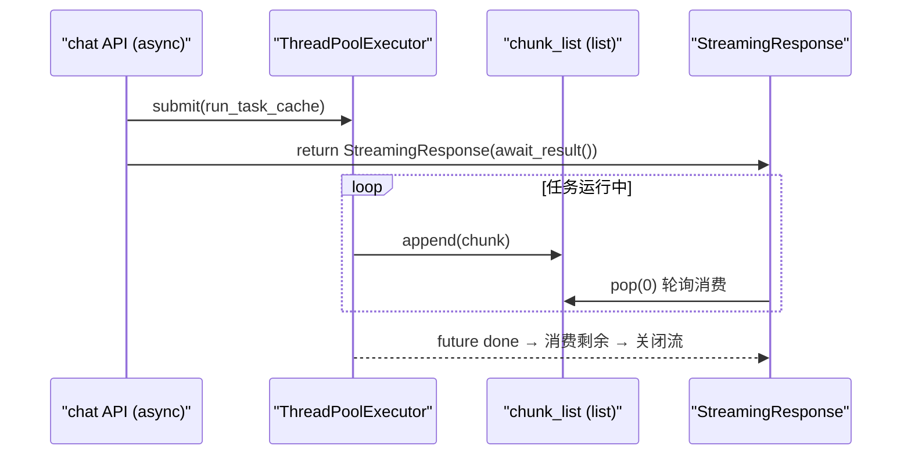
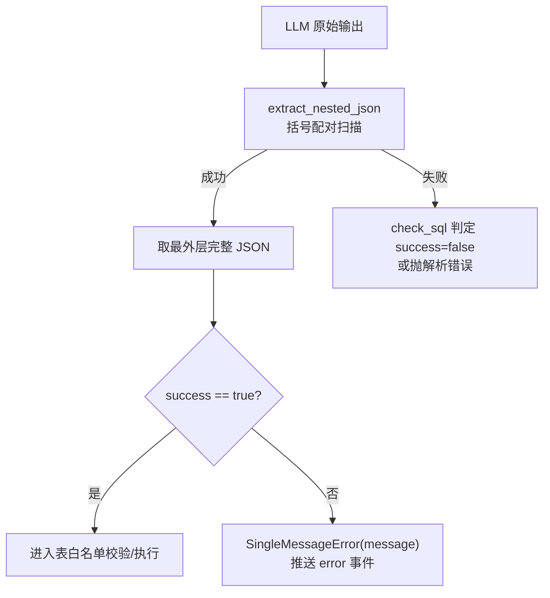
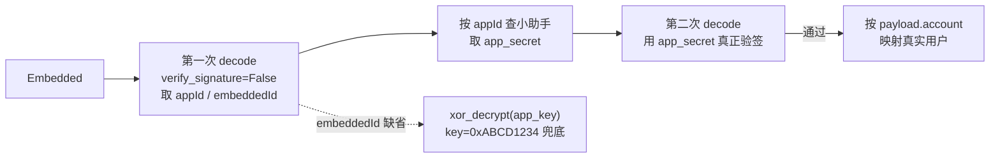
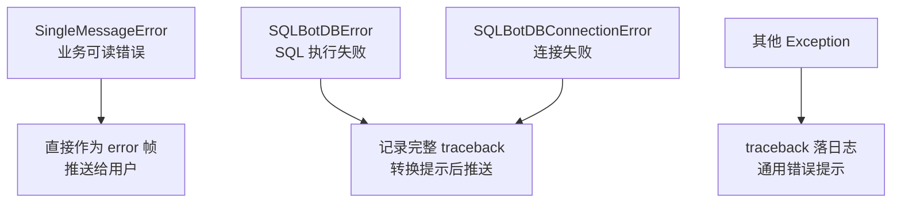

# 第 8 章 源码难点、关键逻辑、坑点解析

本章聚焦阅读源码时最容易困惑、也最容易踩坑的实现细节。
每节按"**现象 → 源码位置 → 原理 → 注意事项**"展开。

---

## 8.1 生产者-消费者桥接：线程池与 SSE 的异步缝合

**难点等级：★★★★★**（全系统最核心的并发设计）

### 现象

`/chat/question` 是 `async def` 端点，但问答流水线
（LLM 流式调用 + 同步数据库驱动执行）运行在
`ThreadPoolExecutor` 的后台线程里，两者如何对接？

### 源码位置

`apps/chat/task/llm.py`：

```python
executor = ThreadPoolExecutor(max_workers=200)          # 模块级线程池

def run_task_async(self, ...):
    self.future = executor.submit(self.run_task_cache, ...)  # 后台线程生产

def run_task_cache(self, ...):
    for chunk in self.run_task(...):                    # 生成器逐块产出
        self.chunk_list.append(chunk)                   # 追加到普通 list

def pop_chunk(self):
    try:
        chunk = self.chunk_list.pop(0)                  # 从头弹出
        return chunk
    except IndexError:
        return None

def await_result(self):                                 # 主协程消费
    while self.is_running():                            # 轮询 future 状态
        while (chunk := self.pop_chunk()) is not None:
            yield chunk
        time.sleep(...)                                 # 空转休眠
    # 收尾：弹出剩余 chunk + 处理异常
```

### 原理



选择这种设计的原因：LangChain 的 `stream()` 与数据库驱动均为
同步阻塞 API，若直接在事件循环中执行会阻塞整个服务；
用 `asyncio.to_thread` 又无法持续流式产出，于是采用
"**后台线程生产 + list 队列 + 协程轮询消费**"的折中方案。

### 注意事项（潜在坑点）

| 问题 | 说明 |
| --- | --- |
| `list.pop(0)` 是 O(n) | chunk 数量大时消费端开销线性增长；SSE 场景 chunk 粒度小、频次高，可考虑 `collections.deque` |
| list 非线程安全容器 | 单生产单消费 + CPython GIL 保证 `append`/`pop` 原子性，目前安全；但若改成多生产者需换 `queue.Queue` |
| 轮询空转 | `is_running(timeout=0.5)` 用 `concurrent.futures.wait` 实现等待，并非忙等，但粒度受 timeout 影响 |
| 客户端断开 | `await_result` 生成器被取消后，后台 future 不会中止，任务仍会跑完并落库（副作用：浪费 token，但记录完整） |

## 8.2 单 Worker 约束：为什么 start.sh 固定 --workers 1

**难点等级：★★★★☆**

`start.sh` 中主服务以 `uvicorn main:app --port 8000 --workers 1` 启动。
这不是保守配置，而是**架构约束**：

1. **进程内缓存**：`CACHE_TYPE=memory` 时 fastapi-cache 在进程内存中，
   多 worker 会出现权限校验缓存不一致；
2. **进程内连接池**：`ConnectionPoolManager`（LRU，max 500）按进程计，
   多 worker 会使真实连接数翻倍，且 `remove_pool` 只清理本进程；
3. **LLM 实例缓存**：`LLMFactory.create_llm` 的 `@lru_cache(32)` 按进程生效；
4. **启动任务防重**：`SingleWorkerGuard` 保证 embedding 回填等启动任务
   只执行一次，多进程会放大竞争窗口；
5. **本地 Embedding 模型**：`EmbeddingModelCache` 单例加载
   sentence-transformers 模型，多 worker 会重复占用内存。

> **二次开发提示**：若需水平扩容，应先把上述状态外置
> （Redis 缓存、独立连接代理如 PgBouncer、共享向量服务），
> 详见第 10 章优化建议。

## 8.3 LLM 输出解析：extract_nested_json 与容错链

**难点等级：★★★★☆**

LLM 输出 JSON 常混有 Markdown 代码块、前后缀文本。解析链为：



`common/utils/utils.py::extract_nested_json` 用**栈式括号配对**
扫描全文，提取所有平衡的 `{...}` / `[...]` 子串逐个尝试
`json.loads`。它不依赖 LLM 输出干净，但有两个边界：

1. JSON 字符串值内若出现未配对的 `{`/`[`（罕见），配对可能错位；
2. 输出多个 JSON 块时取第一个可解析的，依赖 Prompt 约束输出唯一对象。

`check_sql`（llm.py）对解析结果做三重校验：
`success` 标志 → `sql` 非空 → sqlglot 可解析且仅含授权表。
任何一环失败都会转成面向用户的 `SingleMessageError`。

## 8.4 流式思考链解析：<think> 标签的截断处理

**难点等级：★★★★☆**

`process_stream`（llm.py 尾部）需要把 LLM 流式 chunk 拆分为
`content`（正文）与 `reasoning_content`（思考过程）：

- **优先路径**：`chunk.additional_kwargs['reasoning_content']`
  （DeepSeek/OpenAI 兼容推理模型的标准字段）；
- **兜底路径**：当无该字段且启用标签解析时，按 `<think>...</think>`
  文本标签切分。

兜底路径的坑在于 **chunk 可能在标签中间被截断**
（如一个 chunk 结尾恰好是 `<thi`）。源码用
`pending_start_tag` 缓存疑似标签前缀：

```python
if content.endswith(start_tag[:i]):
    if content[:-i].strip() == '':      # 仅当全是空白+残片才缓存
        pending_start_tag = start_tag[:i]
        content = content[:-i]
```

下一轮 chunk 到达时先 `content = pending_start_tag + content` 再判断。
只有"整个 chunk 只剩标签残片"时才挂起，避免误吞正常文本——
这是阅读该函数时最容易绕晕的细节。

## 8.5 多轮上下文的"伪对话"装配

**难点等级：★★★☆☆**

`init_messages` 构建的不是真实历史对话，而是
**每轮重新装配的固定结构**：

```text
System:   系统提示词（角色+规则总纲）
Human:    rules（方言规则 + 输出格式）
AI:       "我已掌握所有规则..."          ← 硬编码确认语
Human:    schema（表结构 + 外键 + 样例数据）
AI:       "我已确认您提供的数据库信息..." ← 硬编码确认语
Human:    术语/数据训练/自定义提示词（RAG 检索结果，可能为空）
...       历史轮次（最多 context_record_count 轮，默认 3）
Human:    当前问题（含时间、语言、上次错误信息）
```

关键点：

1. **历史轮次来自 chat_log**：`get_last_conversation_rounds` 截取
   最近 N 轮，其中 `sqlbot_system=True` 的系统提示词消息被过滤，
   防止提示词随轮次累积撑爆上下文；
2. **AI 确认消息是硬编码中文**（`'我已掌握所有规则...'`），
   未走 i18n——多语言部署时这些"伪 AI 回复"仍是中文
   （只影响注入给 LLM 的上下文，不直接展示给用户）；
3. **last_execute_sql_error 反馈闭环**：`LLMService.__init__` 读取
   上一轮 SQL 执行错误，包进 `<error-msg>` 注入 user prompt，
   让模型在"重新生成"时自我纠错——这是 regenerate 能力的底层支撑。

## 8.6 重新生成链：find_base_question 的递归回溯

**难点等级：★★★☆☆**

"重新生成"不会复制问题文本，而是通过
`regenerate_record_id` 形成记录链。`/regenerate` 指令处理时：

```python
def find_base_question(record_id, session):
    rec_question, rec_regenerate_record_id = ...       # 查当前记录
    if rec_regenerate_record_id:
        return find_base_question(rec_regenerate_record_id, session)  # 递归
    return rec_question
```

即沿链回溯到**最初的原始问题**，再拼接用户在指令后补充的
新约束（`text_before_command`）重新提问。

注意：

- 递归深度 = regenerate 链长度，理论上无上限保护
  （正常业务下链很短，风险可控）；
- 新记录写回 `regenerate_record_id = rec_id`，链条延长而非分叉。

## 8.7 增量持久化与 finally 收敛

**难点等级：★★★☆☆**

`run_task` 的每个关键步骤都会**即时落库**
（`save_sql_answer` → `check_save_sql` → `save_sql_exec_data`
→ `save_chart`），而非任务结束统一写入。收益：

1. 任务中途失败/服务重启，已完成的部分（如 SQL 与数据）不丢失；
2. 前端"执行详情"可回放每一步（chat_log 按 `pid=record.id` 关联）。

收敛保证在 `finally`：

```python
finally:
    self.finish(_session)           # finish_record：置 finish=True
    session_maker.remove()          # 归还线程级 Session
```

无论成功、`SingleMessageError`、`SQLBotDBError` 还是未知异常，
记录都会到达终态，`scoped_session` 不会泄漏到线程池的下一个任务。

> 坑点提醒：`scoped_session` 与线程池复用的组合要求**任务结束必须
> remove**。若在新增后台任务时忘记调用，线程复用会串 Session。

## 8.8 Embedded 令牌的"先解码后验签"

**难点等级：★★★☆☆（安全敏感）**

`auth.py` 的 Embedded 方案流程：



要点与争议：

- 第一次不验签是**必要的**（每个小助手密钥不同，必须先知道
  appId 才能选密钥），真正的安全边界在第二次验签；
- `xor_decrypt` 固定密钥 `0xABCD1234` 只是 base64+XOR **混淆**，
  源码注释亦表明其为 `embeddedId` 缺省时的兜底，不能视为加密；
- 二次开发嵌入场景时，`app_secret` 必须妥善保管在宿主服务端，
  令牌签发应在宿主后端完成，不要暴露到浏览器。

## 8.9 目录命名不一致：curd vs crud

**坑点等级：★★☆☆☆（纯阅读障碍）**

仓库中同时存在两种拼写：

| 拼写 | 模块 |
| --- | --- |
| `curd/` | `apps/chat/curd/`、`apps/terminology/curd/`、`apps/data_training/curd/` |
| `crud/` | `apps/datasource/crud/`、`apps/system/crud/`、`apps/ai_model/`（factory） |

`curd` 是 `crud` 的笔误（"凝乳"），但已成为稳定的包路径，
import 时以实际目录为准，不要"顺手"重命名——会破坏大量导入。

## 8.10 图表配置的列名归一化

**坑点等级：★★☆☆☆**

`check_save_chart` 会把 axis/columns 中所有 `value` 字段
**统一转小写**，因为不同数据库返回的列名大小写不一致
（Oracle 默认大写、PostgreSQL 默认小写），而前端 G2 按
SQL 结果集的实际列名取数。自定义图表逻辑时必须遵守同一约定，
否则出现"配置存在但图上无数据"的现象。

另外 `y` 轴兼容两种历史格式：

- 对象：`"y": {"name":..., "value":...}`（单指标，旧格式）；
- 数组：`"y": [{...}, {...}]`（多指标，现格式）。

## 8.11 错误体系与用户可见性



- `SingleMessageError`：message 视为可直接展示的文案
  （LLM 返回的 `success=false message`、表越权提示等）；
- `SQLBotDBError`：执行错误会被保存为 `last_execute_sql_error`，
  供下一轮 regenerate 注入 Prompt（见 8.5）；
- 任何异常都会经 `trigger_log_error` 落 chat_log，前端"执行详情"
  中可见失败步骤。

## 8.12 其他值得留意的细节

| 细节 | 位置 | 说明 |
| --- | --- | --- |
| SQL 结果截断 | `save_sql_data` | 仅当 `GENERATE_SQL_QUERY_LIMIT_ENABLED` 开启时截断到 1000 行；落库的是截断后数据，导出 Excel 同源 |
| 动态数据源子查询 | `dynamic_subsql_prefix` | type=1/3 小助手的外部数据以 `sqlbot_dynamic_temp_table_*` 临时表形式注入，SQL 中引用该前缀的表会被替换为子查询 |
| 表选择 Top10 | `get_table_schema` | 余弦相似度排序取 Top10，再按 table_relation 补全外键相关表——大库下"选错表"优先检查 embedding 质量与 checked 勾选 |
| 模板回退 | `get_sql_template` | 无对应方言 yaml 时回退 PostgreSQL 模板，新增方言若忘配 yaml 不会报错而是"行为漂移" |
| MCP 复用提问内核 | `mcp_question` | 直接调用 `question_answer_inner(in_chat=False)`，与 Web 共享全部流水线，差异仅在输出格式（Markdown/JSON）与终止档位（finish_step） |
| OpenAPI 占位符 | `apps/swagger/i18n.py` | 所有 `PLACEHOLDER_xxx` 在请求 `?lang=` 时替换，直接看源码中的 summary 是占位符而非文案 |

下一章：[第 9 章 二次开发与集成指南](./09-secondary-development.md)
