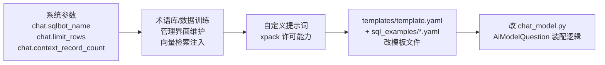
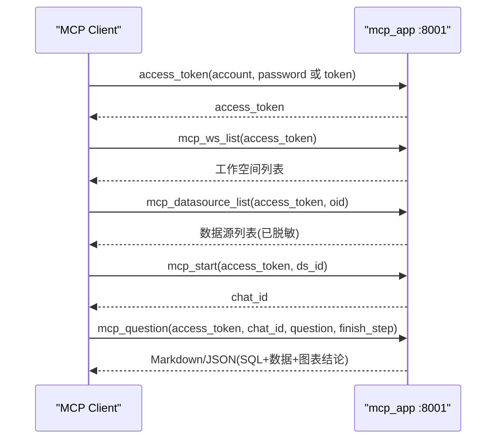

# 第 9 章 二次开发与集成指南

本章面向需要在 SQLBot 上做定制开发或系统集成的工程师，
给出经过源码验证的操作路径与注意事项。

---

## 9.1 本地开发环境搭建

### 9.1.1 后端（Python 3.11 + uv）

```bash
cd backend
uv sync --extra cpu        # CPU 版 torch（本地 embedding 模型用）
# GPU 环境可用 --extra cu128；两个 extra 互斥（pyproject conflicts）

# 配置：后端读取仓库根目录 ../.env（config.py: env_file="../.env"）
# 首次开发可复制 installer 模板变量，至少配置：
#   POSTGRES_SERVER / POSTGRES_USER / POSTGRES_PASSWORD / POSTGRES_DB
#   SECRET_KEY、CACHE_TYPE、LOCAL_MODEL_PATH（本地向量模型目录）

uv run uvicorn main:app --reload --port 8000
```

要点：

- `Settings` 基于 pydantic-settings，**所有配置项均为环境变量**，
  `.env` 放在 `backend/` 的上一级目录；
- 启动时 Alembic 自动升级数据库（`alembic_upgrade`），
  本地需先准备好 PostgreSQL 实例；
- 首次启动会执行 embedding 回填（表/数据源/术语），
  本地向量模型位于 `LOCAL_MODEL_PATH`（容器内默认 `/opt/sqlbot/models`）。

### 9.1.2 前端（Vue 3 + Vite）

```bash
cd frontend
npm install
npm run dev          # 开发服务器，API 指向 .env.development
```

`.env.development` 默认：

```text
VITE_API_BASE_URL=http://localhost:8000/api/v1
```

### 9.1.3 g2-ssr（可选，服务端出图）

```bash
cd g2-ssr
npm install
node app.js          # 或使用 pm2 start ecosystem.config.js
```

后端通过 `request_picture` 调用该服务渲染 PNG；
不启动时图表仍可前端渲染，仅影响图片导出类功能。

## 9.2 新增 LLM 供应商

### 扩展点

`apps/ai_model/model_factory.py`：

```python
class BaseLLM(ABC):
    def __init__(self, config: LLMConfig):
        self.config = config
        self._llm = self._init_llm()          # 子类实现

    @abstractmethod
    def _init_llm(self) -> BaseChatModel:     # 返回 LangChain 实例
        ...

LLMFactory.register_llm("my_supplier", MyLLM)  # 注册即生效
```

### 步骤清单

1. 继承 `BaseLLM`，`_init_llm` 返回 LangChain `BaseChatModel`
   （`ChatOpenAI`、`ChatAnthropic` 等均可）；
2. 在模块导入时调用 `LLMFactory.register_llm("类型码", 类)`；
3. `ai_model` 表新增记录时 `protocol`/类型码与注册名对应，
   前端模型管理页补充供应商表单项；
4. 注意 `LLMConfig` 是 frozen dataclass 且自定义了 `__hash__`，
   `create_llm` 有 `@lru_cache(32)`——同配置复用实例，
   **不要在 LLM 实例上挂可变状态**。

> 捷径：若目标供应商提供 OpenAI 兼容接口（绝大多数国产模型均有），
> 无需写代码——新增模型时选 openai 协议，填 `api_base_url` 即可。

## 9.3 新增数据库方言

以新增"OceanBase"为例，共 5 个触点：

| # | 文件 | 改动 |
| --- | --- | --- |
| 1 | `apps/db/constant.py` | `DB` 枚举注册：类型码、展示名、标识符前后缀（`` ` ``/`"`/`[]`）、连接方式（sqlalchemy / py_driver）、`template_name`、非法参数黑名单 |
| 2 | `apps/db/db.py` | `get_engine`（sqlalchemy URL）或 `get_driver_connection`（原生驱动）分支；`get_sqlglot_dialect` 方言映射；`get_dangerous_functions` 按需定制 |
| 3 | `apps/db/db_sql.py` | `get_version_sql` / `get_table_sql` / `get_field_sql` 补充元数据查询 SQL（information_schema 风格） |
| 4 | `templates/sql_examples/<TemplateName>.yaml` | 方言规则与 SQL 示例（文件名必须等于枚举的 `template_name`）；缺失会**静默回退 PostgreSQL 模板** |
| 5 | `apps/datasource/crud/datasource.py` | `preview` / `get_table_sample_data` 的预览与样例 SQL 分支 |

前端同步：数据源类型选择、连接配置表单（`views` 下数据源页面）
与 i18n 文案。

验证路径：创建数据源 → `sync_table` 成功同步表/字段
→ 问数生成 SQL 通过 `check_sql_read` 并执行。

## 9.4 Prompt 定制（不改代码优先）

按侵入性从低到高：



改模板文件的注意事项：

- 模板渲染用 Python `str.format`，业务文本里的花括号必须
  写成 `{{` / `}}`，否则启动后提问即报 `KeyError`；
- `template.yaml` 键位（`sql.system`/`sql.rules`/`sql.user`/
  `chart.*`/`guess`/`analysis`/`predict`/`datasource`/
  `permissions`/`dynamic_sql` 等）与 `AiModelQuestion`
  的装配方法一一对应，新增键位需同步改装配代码；
- 输出格式约束（JSON 协议字段 `success/sql/tables/chart-type/brief`）
  与 `check_sql` 解析强耦合，**不要改动字段名**。

## 9.5 新增 REST 接口并暴露为 MCP Tool

### 普通接口

遵循现有分层：`api/`（路由+权限装饰器）→ `curd|crud/`（业务）→
`models/`（SQLModel）→ `schemas`（DTO）。模板：

```python
@router.post("/my_op")
@require_permissions(permission=SqlbotPermission(
    type='chat', keyExpression="request_question.chat_id"))
@system_log(LogConfig(operation_type=OperationType.CREATE, ...))
async def my_op(session: SessionDep, current_user: CurrentUser, ...):
    return await asyncio.to_thread(inner, session, current_user, ...)
```

要点：同步 SQLAlchemy 操作必须 `asyncio.to_thread` 包裹；
路由注册到 `apps/api.py` 的 `api_router`。

### 暴露为 MCP Tool

两步：

1. 端点声明 `operation_id="mcp_my_op"`；
2. `main.py` 的 `FastApiMCP(app, include_operations=[...])`
   列表中加入该 id。

`mcp_app`（8001 端口）会自动把该操作生成 MCP Tool，
工具描述来自端点的 OpenAPI summary（注意使用
`PLACEHOLDER_xxx` 占位符以支持多语言）。

## 9.6 系统集成：MCP 客户端对接

典型调用序列（以 MCP 客户端/Agent 视角）：



- `finish_step` 三档：仅生成 SQL / 到数据 / 到图表
  （`ChatFinishStep`），按需节省耗时与 token；
- 第三方系统动态数据源场景用 `mcp_assistant`：传入数据接口 URL
  与凭证，构造临时 type=1 小助手直接问数；
- API Key（SK 方案）适合长期集成：`sys_apikey` 表绑定用户，
  请求头 `X-SQLBOT-ASK-TOKEN: SK <jwt>`。

## 9.7 嵌入式小助手（Assistant）集成

三种集成形态（对应 `AssistantModel.type`）：

| 形态 | type | 凭证 | 说明 |
| --- | --- | --- | --- |
| 独立问答页 | 0 / 2 | Assistant Token | `configuration.oid` 指定工作空间数据源 |
| 第三方 API 数据源 | 1 / 3 | Assistant Token | 数据源清单由外部接口动态下发（`AssistantOutDs`） |
| 页面嵌入 | 4 | Embedded Token | 宿主后端用 `app_secret` 签发，payload 带 `account` 映射用户 |

集成注意：

1. **CORS 自动注册**：小助手保存时 `init_dynamic_cors` 把
   `domain` 加入允许来源，无需改 `BACKEND_CORS_ORIGINS`；
2. Embedded 令牌签发必须在**宿主服务端**完成（见 8.8 安全分析）；
3. 前端 `utils/request.ts` 已按小助手模式自动添加
   `Assistant`/`Embedded` 前缀，嵌入页面复用同一套前端资源
   （`embedded.html` 入口）。

## 9.8 二次开发检查清单

- [ ] 新增表：SQLModel 模型 + Alembic 版本脚本（`alembic/versions/`，
      命名顺延序号，启动时自动 upgrade）；
- [ ] 新增接口：权限装饰器 + `asyncio.to_thread` + 系统日志装饰器；
- [ ] 涉及数据源的新功能：考虑连接池清理
      （`remove_pool`）与缓存失效（`@clear_cache`）；
- [ ] 多语言：后端 `locales/*.json` + 前端 `i18n/`；
      OpenAPI summary 用占位符；
- [ ] 不要重命名 `curd/` 目录、不要改动 LLM JSON 协议字段名、
      模板花括号记得转义；
- [ ] 单 worker 约束未解除前，不要配置 `--workers N > 1`。

下一章：[第 10 章 总结与优化建议](./10-summary-and-suggestions.md)
