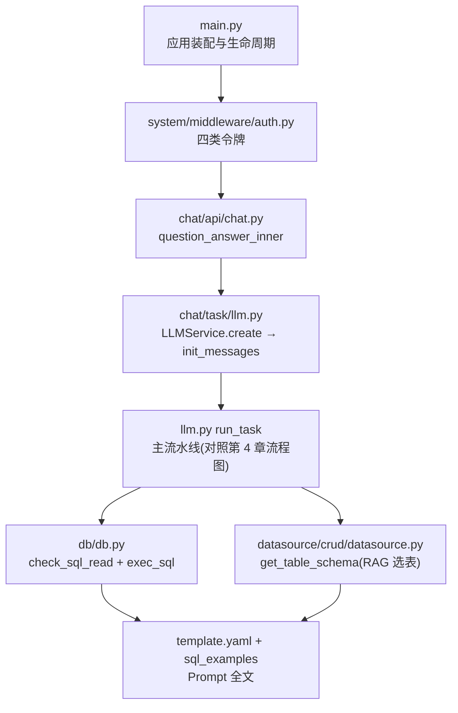

# 第 10 章 总结与优化建议

## 10.1 全文回顾

本文档基于 SQLBot 仓库真实源码，完成了从部署到内核的完整解读：

| 章节 | 核心结论 |
| --- | --- |
| 第 1 章 | SQLBot 是 RAG 驱动的开源 ChatBI：问题 → 检索增强 → SQL → 数据 → 图表一站式问答 |
| 第 2 章 | installer 一键脚本 / docker-compose / 源码三种部署形态；`start.sh` 串联 postgres、g2-ssr(pm2)、MCP(8001)、主服务(8000) |
| 第 3 章 | 四层架构：接入层（FastAPI+中间件）→ 编排层（LLMService 流水线）→ 能力层（RAG/模型工厂/多库执行）→ 存储层（PostgreSQL+向量+连接池） |
| 第 4 章 | Text2SQL 全流程：RAG 上下文装配 → 表选择(Top10) → SQL 生成(JSON 协议) → 白名单/只读校验 → 行权限改写 → 执行 → 图表配置 → 可选 PNG，全程 SSE 推送 |
| 第 5 章 | backend 模块化（chat/datasource/db/ai_model/system/mcp/template），frontend Vue3 三形态入口，g2-ssr 服务端渲染 |
| 第 6 章 | `LLMService` 为运行时中枢；ChatRecord 增量持久化 + chat_log 步骤级埋点构成可回放的执行轨迹 |
| 第 7 章 | 四类令牌认证、工作空间隔离、行列权限三重防线、`check_sql_read` 四层只读校验、声明式缓存与单实例守卫 |
| 第 8 章 | 关键设计均有明确取舍：线程池+SSE 桥接、单 worker 约束、伪对话上下文、错误反馈闭环 |
| 第 9 章 | 扩展面清晰：LLM 供应商（register_llm）、数据库方言（5 触点）、Prompt 模板、MCP Tool（operation_id） |

## 10.2 架构亮点

1. **安全纵深合理**：表越权白名单（sqlglot AST 提取真实表名）、
   SQL 只读四层校验、列权限 Schema 隐藏、行权限改写后再校验，
   形成"生成侧约束 + 执行侧兜底"的双闸门；
2. **可观测性内建**：`OperationEnum` 14 步埋点 + chat_log 记录
   完整 messages/reasoning_content/token_usage，"执行详情"
   可直接回放每次 LLM 交互，是同类开源项目中少见的完整度；
3. **扩展点设计克制而有效**：`register_llm`、`operation_id`→MCP、
   方言 yaml 模板均为"注册式"扩展，核心流水线无需改动；
4. **工程成熟度**：Alembic 自动迁移、四语言 i18n（含 OpenAPI 文档）、
   xpack 许可降级、启动防重守卫、连接池 LRU 回收，
   生产化细节考虑周全；
5. **RAG 策略务实**：表/数据源/术语/SQL 示例四类向量分层检索，
   配合表关系图补全外键表，解决了大库场景"选错表"的核心痛点。

## 10.3 优化建议

以下建议均源于源码中可验证的局限，按优先级排序：

### P0 —— 正确性与稳定性

| # | 现状 | 建议 |
| --- | --- | --- |
| 1 | `chunk_list` 用普通 `list` 做跨线程队列，`pop(0)` 为 O(n)，安全性依赖 GIL 与单生产单消费假设 | 替换为 `queue.Queue` 或 `collections.deque`；若需异步原生，可重构为 `asyncio.Queue` + 线程池 `call_soon_threadsafe` |
| 2 | 客户端断开 SSE 后后台任务继续跑完 | 在 `await_result` 捕获 `GeneratorExit`，设置取消标志让 `run_task` 提前收敛（至少停止后续 LLM 调用，节省 token） |
| 3 | `find_base_question` 递归无深度保护 | 加最大深度（如 50）或改为迭代回溯 |

### P1 —— 水平扩展能力

| # | 现状 | 建议 |
| --- | --- | --- |
| 4 | 单 worker 约束（内存缓存/连接池/lru_cache/embedding 单例均在进程内） | 分阶段外置：`CACHE_TYPE=redis` 已支持 → 连接池改为外部代理（PgBouncer/各库代理）→ embedding 计算拆独立服务 → 任务执行拆 Worker（Celery/arq），API 层即可多副本 |
| 5 | g2-ssr 单点，出图失败只影响图片 | 无状态化后可多副本 + 健康检查；或直接下沉为按需容器（冷启动场景少） |

### P2 —— 功能与体验

| # | 现状 | 建议 |
| --- | --- | --- |
| 6 | `init_messages` 中 AI 确认语硬编码中文，未走 i18n | 迁入 `template.yaml` 或 locales，按用户语言装配（影响多语言部署下的上下文一致性） |
| 7 | 行权限 WHERE 由 LLM 改写注入，存在改写偏差风险 | 提供确定性改写选项：对简单规则（等值/范围）直接用 sqlglot AST 注入 WHERE，LLM 仅处理复杂表达式 |
| 8 | 表选择固定 Top10 + 关系补全 | Top-K 可配置化；对超大库引入两级检索（先库/主题域后表）或 rerank 模型 |
| 9 | `curd`/`crud` 目录拼写不一致 | 以一次破坏性 PR 统一为 `crud`（配合别名兼容过渡），降低新人阅读成本 |

### P3 —— 工程质量

| # | 现状 | 建议 |
| --- | --- | --- |
| 10 | `tests/` 仅 4 个测试文件，核心流水线无回归测试 | 优先为 `check_sql_read`、`extract_nested_json`、`extract_tables_from_sql`、权限过滤树转 WHERE 等纯函数补充单测；LLMService 可用 mock LLM 做流水线级测试 |
| 11 | `llm.py` 单文件约 1970 行，职责混合（消息装配/流水线/持久化/流解析） | 按职责拆分：`pipeline.py`（run_task 编排）、`stream.py`（process_stream）、`persist.py`（save_* 族），降低维护成本 |
| 12 | `xor_decrypt` 固定密钥混淆方案 | Embedded 场景统一要求 payload 携带 `embeddedId`，逐步废弃固定密钥兜底路径 |

## 10.4 源码阅读路线推荐

给后续读者的最短路径（约 4~6 小时可通读主干）：

阅读技巧：

1. 带着一次真实提问的 SSE 帧序列（第 4 章协议表）对照 `run_task`
   的 yield 点，能最快建立全局感；
2. chat_log 的 `operate` 枚举即流水线步骤目录，
   配合"执行详情"界面逐步骤读对应代码；
3. 方言差异全部收敛在 `DB` 枚举 + `db_sql.py` + `sql_examples/`，
   读新数据库支持时只看这三处。

## 10.5 结语

SQLBot 以不到两万行的核心代码，实现了"**认证-权限-RAG-生成-校验-
执行-可视化-集成**"的完整 Text2SQL 闭环，其安全设计（双闸门校验、
行列权限三重防线）与可观测性（步骤级执行轨迹）在开源同类中表现突出。
它当前的主要边界在于单实例架构与 LLM 参与的安全改写环节，
这两点也正是二次开发与贡献的最佳切入点。

---

**全文完**。本文档所有结论均可在仓库源码中逐条验证，
引用位置以 `文件路径::函数名` 为准；如发现与最新版本代码不符，
以代码为准并欢迎修订本文档。
